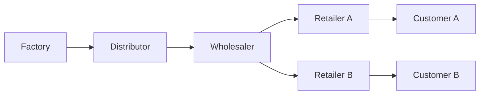

# Beer Distribution Game

**[▶ Play](https://beer-distribution-game.pages.dev/)** · [Hugging Face Space](https://constantinertel-beer-distribution-game.static.hf.space/) · [Deploy](DEPLOY.md)

A deterministic Y-network beer game: one agent is the **wholesaler**, with delayed
orders/shipments and fog-of-war observations. The public static app and live-Y
research board use **factory capacity 400** and lock play to the wholesaler. The
Prime Intellect / Verifiers Hub package still freezes Tier-5 at **capacity 22**
for historical parity ([`environments/beer_distribution_game/`](environments/beer_distribution_game/)).



## Benchmark (capacity 400)

Sixteen fixed live-Y seeds, research prompt (demand law and capacity withheld).
Protocol-failed episodes are dropped from each model mean.


| Model | Mean cost \(\overline{C}\) | Score | Clean |
| --- | ---: | ---: | ---: |
| Laguna S 2.1 (free) | 2584.4 | **14.02** | 7/16 |
| DeepSeek V4 Flash | 4031.3 | **7.12** | 16/16 |
| Nemotron 3 Ultra (free) | 5379.0 | **6.56** | 2/16 |

Artifacts: [`artifacts/live_y_capacity_400/evaluations/`](artifacts/live_y_capacity_400/evaluations/).

### How the score is calculated

**Weekly local cost** for the controlled role (holding \(0.5\), backlog \(1.0\)):

$$
c_t = 0.5\, I_t + 1.0\, B_t
$$

**Episode cost** over \(H=36\) decision weeks, \(3\) settlement weeks (zero new
orders), and a terminal inventory-position charge:

$$
\begin{aligned}
IP &= I + \text{on\_order} - B \\
c^{\mathrm{term}} &= 0.5\max(IP,0) + 1.0\max(-IP,0) \\
C &= \sum_{t=1}^{H} c_t + \sum_{t=H+1}^{H+3} c_t + c^{\mathrm{term}}
\end{aligned}
$$

**Hindsight-perfect cost** \(C^\*\) is the best feasible open-loop wholesaler
action sequence found on each CRN-fixed seed (order-up-to / tuned-adaptive
grids, warm starts, coordinate descent). Reported \(C^\*\) is an upper bound on
the true optimum:

$$
C^\*_{\mathrm{true}} \le C^\*
$$

Across the 16 seeds, \(\overline{C^\*} = 287.22\) and adaptive base-stock averages
\(388.84\) (\(\approx 1.35\times\) perfect).

**Published score** (protocol-clean episodes only):

$$
\mathrm{score} = 100 \times \frac{\overline{C^\*}}{\overline{C_{\mathrm{policy}}}}
$$

So \(100\) means matching hindsight-perfect cost; lower means more expensive.

Script: [`scripts/compute_live_y_hindsight_perfect.py`](scripts/compute_live_y_hindsight_perfect.py).

## Layout

| Path | Role |
| --- | --- |
| [`static_web/`](static_web/) | Public JS game (capacity 400, wholesaler-only) |
| [`environments/beer_distribution_game/`](environments/beer_distribution_game/) | Hub / Prime Intellect package (Tier-5 capacity 22) |
| [`beer_distribution_rl/`](beer_distribution_rl/) | Research sim, agents, live-Y protocol |
| [`artifacts/live_y_capacity_400/`](artifacts/live_y_capacity_400/) | Current OpenRouter board + \(C^\*\) |
| [`docs/`](docs/) | Frozen Hub specs (`ENVIRONMENT_SPEC`, `REWARD_SPEC`, `DIFFICULTY_LADDER`) |

## Run locally

```bash
python -m pip install -e ".[dev]"
python -m pytest -q
npm ci && npm run test:all && npm run build
```

MIT. No API keys in the repo.
