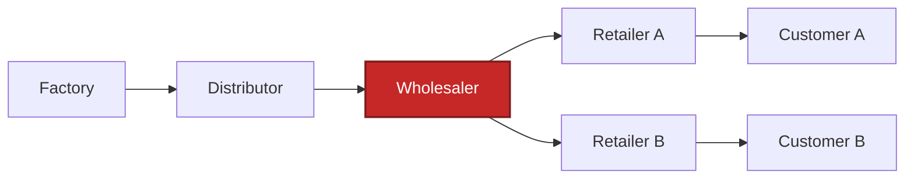

# Supply Chain RL Environment & Benchmark (SupplyChainBench)

**[▶ Play the stochastic v2 game](https://constantinvictorbeatertel.github.io/Supply_Chain_Bench/)**

**Can an AI agent learn to control a delayed, partially observed system?**

SupplyChainBench measures long-horizon decision-making under hidden and changing
dynamics through the beer distribution game. In the beer supply chain distribution game, an agent runs the wholesaler for 36 weeks.
Orders and shipments take time, so mistakes are only visible weeks later.

The project measures three things:

- **Forecasting:** can the agent accurately think through the future cost implications of its actions?
- **Adaptation:** can it adapt when demand or supply changes?
- **Learning:** Can an LLM improve at the above two tasks through training? 

## Motivation

One central pillar that our personal lives, as well as society, rest on is the ability to forecast the future.
This is inherently difficult because the future is unknown. Doing it well requires pulling together context, determining what information matters, and understanding how actions today can affect outcomes much later.

I wanted to build a task that could both test and teach this kind of long-horizon reasoning. I thought back to the Beer Distribution Game from a supply chain class I had taken.

The game is particularly useful because of its delays. Orders and shipments take time to arrive, so an action that looks reasonable today may create excess inventory or backlog several weeks later. To perform well, an agent has to think ahead while simultaneously accounting for decisions already moving through the supply chain.

SupplyChainBench turns that idea into an RL environment and benchmark. An agent controls the wholesaler for 36 weeks without being told the underlying demand law or supply limits, and is evaluated on its ability to control costs, adapt when the environment changes, and learn across episodes.

For training, I use GRPO + LoRA. GRPO compares sampled actions against other rollouts, while LoRA efficiently updates the policy without changing the frozen Qwen3.5-4B base model. Because an order's effects are delayed, each decision is scored using a six-week downstream cost window.

The trained adapter also transfers substantially better than its base model to
the stochastic game. On the same 16 held-out benchmark seeds,
Qwen3.5-4B improves from a score of 11.78 untrained to 38.42 with the trained
adapter, while mean cost falls from 4,742.3 to 1,453.6. The adapter has not yet
been retrained on the stochastic environment.

The broader goal is not only to benchmark supply-chain reasoning, but to explore whether environments with delayed consequences and long horizons can train more general decision-making abilities.

## Game Setup



The game contains four roles - factory, distributor, wholesaler, and retailer. 

The customer at the end demands beer according to a random distribution. 
The retailer tries to fulfill this demand. There is a cost associated with not fulfilling orders and with backlog. 
Hence, every role tries to match the demand as accurately as possible. 
The demand from the retailer is fulfilled by the wholesaler, which is fulfilled by the distributor, and so on. 
However, orders only arrive two weeks after they ordered. 

## Technical benchmark details

The game is plater over 36 weeks. Factory capacity is 400. Every week resamples customer demand randomly. 
The LLM prompt withholds the demand law and the capacity.
Higher is better. 


The scores are based on how low the costs are compared to the mathematically optimal cost (which results in a score of 100). 

Artifacts: [`artifacts/live_y_domain_randomized_grpo_v2/evaluations/`](artifacts/live_y_domain_randomized_grpo_v2/evaluations/).
The chart is generated from the leaderboard JSON by
[`scripts/render_capacity_400_scoreboard.py`](scripts/render_capacity_400_scoreboard.py),
so it cannot drift from the evaluations.

### Scoring

Weekly local cost (holding $0.5$, backlog $1.0$):

$$
c_t = 0.5\, I_t + 1.0\, B_t
$$

Episode cost over $H=36$ decision weeks, $3$ settlement weeks, and terminal
inventory-position charge ($O$ = on-order pipeline):

$$
\begin{aligned}
IP &= I + O - B \\
c^{\mathrm{term}} &= 0.5\max(IP,0) + 1.0\max(-IP,0) \\
C &= \sum_{t=1}^{H} c_t + \sum_{t=H+1}^{H+3} c_t + c^{\mathrm{term}}
\end{aligned}
$$

Best found feasible $C^{\star}$:

$$
\overline{C^{\star}} = 558.44,
\qquad
\text{adaptive base-stock average} = 802.53
$$

The  score pairs every model week performance with the reference
for the exact same week:

$$
\mathrm{score} = 100 \times
\frac{\sum_s C^{\star}_{s}}
     {\sum_s C^{\mathrm{policy}}_{s}}
$$


## Qwen fine-tune (live-Y GRPO)

**[▶ Explore the LoRA + GRPO learning loop](https://constantinvictorbeatertel.github.io/Supply_Chain_Bench/lora-grpo/)**

<p align="center">
  <a href="https://constantinvictorbeatertel.github.io/Supply_Chain_Bench/lora-grpo/">
    
  </a>
</p>

*GRPO supplies the comparison and credit-assignment objective. LoRA is the
trainable parameterization that receives those gradients while the base model
stays frozen.*

The training pipeline trains a LoRA adapter on `Qwen/Qwen3.5-4B` with
critic-free multi-turn group-relative updates (GRPO-style). 

Each update rolls out 8 matched seeds 6 times, scores every order against its
groupmates using a 6-week downstream-cost window, and applies a clipped
token-level update to the digits in `{"quantity": N}`. In short, GRPO decides
which sampled actions were better. I chose LoRA because it is a computer efficient way to 
make those actions more likely.

Full details: [`docs/TRAINING.md`](docs/TRAINING.md) ·
[`artifacts/live_y_best_adapter/`](artifacts/live_y_best_adapter/)

## Hyperefficient compute

Documented in [`docs/LIVE_Y_EFFICIENCY.md`](docs/LIVE_Y_EFFICIENCY.md):

- Prefix KV cache across shared chat-template tokens. 
- Batched rollouts. separate inference / train minibatches. LoRA + bf16 + gradient checkpointing
- Bounded JSON completions (32-token train cap); rolling history window, not full transcript


## How it is built

| Layer | Role |
| --- | --- |
| Python oracle (`environments/…/core.py`, research env) | Seeded simulator + grader |
| [`static_web/`](static_web/) | Browser JS port, parity-checked against the oracle |
| [`beer_distribution_rl/`](beer_distribution_rl/) | Research protocol, agents, GRPO / eval harness |
| [`environments/beer_distribution_game/`](environments/beer_distribution_game/) | Verifiers Hub package (Tier-5 capacity 22) |

## Run locally

```bash
python -m pip install -e ".[dev,benchmark]"
python -m pytest -q
python -m supplychainbench.eval --model agent:constant-18 --suite standard
python -m supplychainbench.leaderboard
npm ci
npm run test:all
npm run build
```
