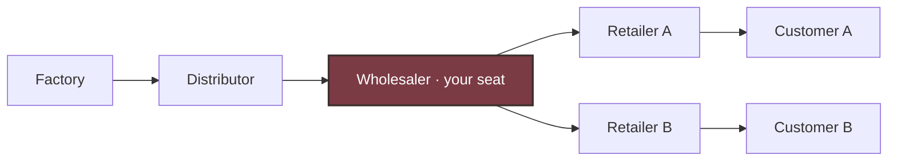
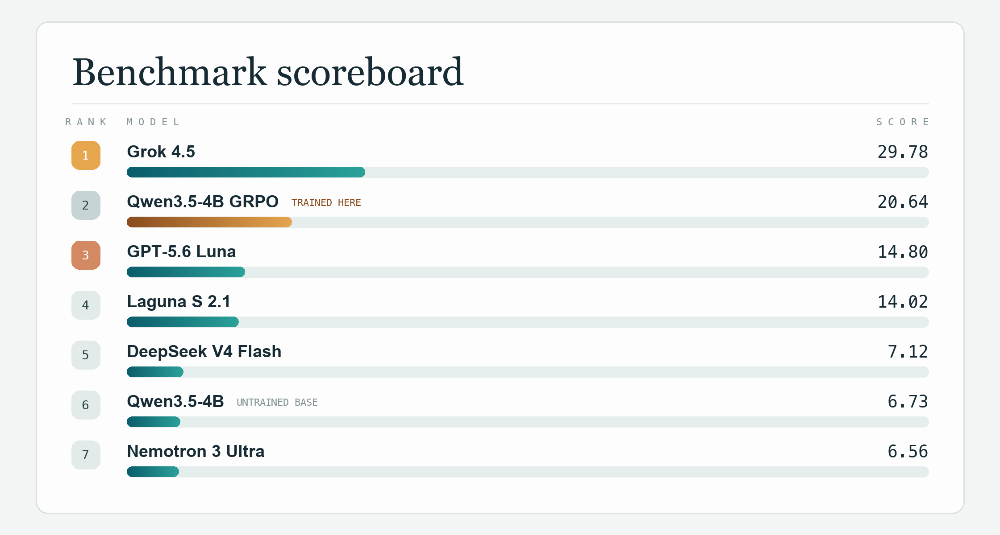

# SupplyChainBench: Beer Distribution

**[▶ Play the game](https://beer-distribution-game.pages.dev)**

**Can an AI agent learn to control a delayed, partially observed system—not
just produce a good one-shot answer?**

SupplyChainBench measures long-horizon decision-making under hidden and changing
dynamics. In Beer Distribution, an agent runs the wholesaler for 36 weeks.
Orders and shipments take time, mistakes are only visible weeks later, and the
agent is not told the demand law or supply limits.

The project measures three things:

- **Control:** can the agent keep inventory and backlog costs low?
- **Adaptation:** can it recover when demand, delays, or supply change?
- **Learning:** does improvement come from a bounded notebook or real LoRA
  weight updates across episodes?

## Benchmark

The main test uses 16 fixed supply chains. The agent controls the wholesaler
without being told the demand pattern or supply limit.

Five additional tests change demand, delivery times, or supply to see whether
the agent notices and recovers. Separate experiments compare starting fresh,
carrying short notes between games, and updating model weights. Their scores
stay separate so unlike tests are not compared directly.

The browser replay shows a simple baseline, the untrained model, and the trained
model facing the same supply chain.

The chain is a Y: **one** wholesaler splitting a single inventory pool between
**two** retailers who compete for it. 



You and the recorded model each play that one wholesaler seat in your own sealed
episode, on the same seed against the same scripted counterparties — two runs of
the same chain, not two live seats in one chain. The playable board shows both
as a station pair so you can watch them diverge.

## Technical benchmark details

36 weeks each, factory capacity 400. The LLM prompt
withholds the demand law and the capacity. 



For reference on the same seeds: hindsight-perfect scores 100, an adaptive
base-stock heuristic 73.9, and the best blind constant-order policy — order 18
every week, never reading the observation — 19.8.

Artifacts: [`artifacts/live_y_capacity_400/evaluations/`](artifacts/live_y_capacity_400/evaluations/).
The chart is generated from the leaderboard JSON by
[`scripts/render_capacity_400_scoreboard.py`](scripts/render_capacity_400_scoreboard.py),
so it cannot drift from the evaluations.

### Scoring

Weekly local cost (holding $0.5$, backlog $1.0$):

$$
c_t = 0.5\, I_t + 1.0\, B_t
$$

Episode cost over $H=36$ decision weeks, $3$ settlement weeks, and terminal
inventory-position charge ($O$ = on-order pipeline):

$$
\begin{aligned}
IP &= I + O - B \\
c^{\mathrm{term}} &= 0.5\max(IP,0) + 1.0\max(-IP,0) \\
C &= \sum_{t=1}^{H} c_t + \sum_{t=H+1}^{H+3} c_t + c^{\mathrm{term}}
\end{aligned}
$$

Hindsight-perfect $C^{\star}$ is a feasible open-loop upper bound on each CRN seed.
Across all 16 seeds the reference means are:

$$
\overline{C^{\star}} = 287.22,
\qquad
\text{adaptive base-stock average} = 388.84
$$

Both means are taken over the same protocol-clean subset $S$ of the 16 seeds, so
a model that fails episodes is scored against the perfect reference for the
seeds it actually finished:

$$
\mathrm{score} = 100 \times
\frac{\frac{1}{|S|}\sum_{s \in S} C^{\star}_{s}}
     {\frac{1}{|S|}\sum_{s \in S} C^{\mathrm{policy}}_{s}}
$$

For every model that finished all 16 the numerator is the 287.22 above; the two
free models did not, so their references are re-based (Laguna 7/16 clean,
$\overline{C^{\star}} = 362.36$; Nemotron 2/16, $352.75$). Read those two bars
as small-sample.

## Qwen fine-tune (live-Y GRPO v1)

[`scripts/train_live_y_domain_randomized_grpo_v1.py`](scripts/train_live_y_domain_randomized_grpo_v1.py)
trains a LoRA adapter on `Qwen/Qwen3.5-4B` with critic-free multi-turn
group-relative updates (GRPO-style). Research capacity is 400; Hub Tier-5
stays 22.

### What LoRA trains

The 4B base weights stay frozen in bf16. A rank-16 / alpha-16 LoRA adapter
(dropout 0) is attached to `q_proj`, `k_proj`, `v_proj`, `o_proj`, `gate_proj`,
`up_proj`, `down_proj`, and it is the only thing the optimizer touches. The
target behaviour — order roughly what you sold, and count the units already in
the pipeline — is a small behavioural adjustment rather than new knowledge, so
rank 16 across all seven projections is ample. It also keeps rollouts and
training on one GPU, since the frozen base is shared.

### What RL does with it

One update is: roll out, grade each decision, reweight the tokens that carried
it.

1. **Roll out.** Pick training seeds; play each one `group_size` times. Group
   members share a scenario, a demand seed, and counterparty streams (CRN), so
   they differ only through sampling. Each week the policy sees the role-local
   observation and emits `{"quantity": N}`.
2. **Grade.** Every decision gets a windowed return-to-go, group-normalized at
   the same timestep.
3. **Update.** A token-level clipped importance-ratio step on the LoRA
   parameters only.

Demand is `episode_randomized_y_poisson_v1`: per episode,
$\lambda \sim \mathcal{U}[2,8]$, then independent Poisson draws for each retailer.

**Credit window.** An order clears the order delay (1 week) and shipment delay
(2 weeks) within ~3 weeks and washes out by ~6, so a decision is charged for
$W = 6$ weeks of downstream local cost, not the whole remaining episode.
Settlement and terminal exposure are attributed only to decisions whose window
reaches the horizon $H$; a protocol failure inside the window contributes
$-10^{5}$:

$$
G_{i,t} = -\sum_{u=t}^{\min(t+W,\,H)-1} \gamma^{\,u-t} c_{i,u}
\;+\; \mathbf{1}[t + W \ge H]\;\gamma^{\,H-t}\,r^{\mathrm{term}}_{i}
$$

with $\gamma = 1$ by default. Unbounded return-to-go
($W \to \infty$, the archived setting) left only ~10% of the advantage variance
genuinely per-turn — see
[`docs/LIVE_Y_RL_POSTMORTEM.md`](docs/LIVE_Y_RL_POSTMORTEM.md).

**Advantage.** Same-timestep group mean and standard deviation, so the
surrogate sees a unit-scale signal rather than raw cost units:

$$
A_{i,t} = \frac{G_{i,t} - \mu_{g,t}}{\sigma_{g,t}},
\qquad
\mu_{g,t} = \frac{1}{|g|}\sum_{j \in g} G_{j,t}
$$

then clamped to $\pm 10$. A decision whose window caught a protocol failure
skips normalization and takes a fixed $A = -5$: normalizing the raw $-10^{5}$
against its groupmates would rescale it to roughly $-1.7$, indistinguishable
from an ordinary bad week, while leaving it raw would let one record own the
update.

**Objective.** The ratio is per-token over the tokens that encode the order,
not a mean over the whole completion, and the clip is double-sided so a badly
off-policy token with a negative advantage cannot dominate a minibatch.
For each scored token $k$ of decision $(i,t)$, with
$r_k = \exp\big(\ell_\theta(y_k) - \ell_{\mathrm{old}}(y_k)\big)$ and
$s_k = \min\big(r_k A_{i,t},\; \mathrm{clip}(r_k, 1-\varepsilon, 1+\varepsilon)\,A_{i,t}\big)$:

$$
\mathcal{L} = -\,\mathbb{E}_{k}\big[\tilde{s}_k\big],
\qquad
\tilde{s}_k =
\begin{cases}
\max\big(s_k,\; c\,A_{i,t}\big) & A_{i,t} < 0\\[2pt]
s_k & A_{i,t} \ge 0
\end{cases}
$$

with $\varepsilon = 0.2$ and dual-clip $c = 3$. Only the digits of
`{"quantity": N}` are scored — averaging over the whole completion let seven
boilerplate tokens outvote the one token carrying the decision.

### Result

| | untrained | trained |
|---|---:|---:|
| capacity-400 score (16 held-out seeds) | 6.73 | **20.64** |
| mean local cost | 4264.7 | **1391.8** |
| protocol-clean episodes | 16/16 | **16/16** |

A 3.1× score improvement over the same base model, better on all four demand
buckets including the three never trained on. Over training, mean weekly order
in the rollouts fell from ~22.9 at update 1 to ~17.5 by the last, against an
obligation near 16/week — the over-ordering habit that dominates cost in this
game.

Two caveats worth stating up front: this clears the best blind constant-order
baseline (19.82) by only 0.82 points, and both training runs used the same seed
(`20260808`), so run-to-run variance is unmeasured.

Full recipe in [`docs/TRAINING.md`](docs/TRAINING.md). An earlier two-update run
scored 7.48 — indistinguishable from the untrained base — and
[`docs/LIVE_Y_RL_POSTMORTEM.md`](docs/LIVE_Y_RL_POSTMORTEM.md) documents why it
could not have worked.

Weights: [`artifacts/live_y_best_adapter/`](artifacts/live_y_best_adapter/).

## Hyperefficient compute

Documented in [`docs/LIVE_Y_EFFICIENCY.md`](docs/LIVE_Y_EFFICIENCY.md):

- Prefix KV cache across shared chat-template tokens; invalidate after each LoRA update
- Batched rollouts; separate inference / train minibatches; LoRA + bf16 + gradient checkpointing
- Bounded JSON completions (32-token train cap); rolling history window, not full transcript
- `torch.inference_mode` for generation / old-policy scoring; critic-free group baselines (no value net)
- CRN / fixed seed derivation to cut rollout variance

## How it is built

| Layer | Role |
| --- | --- |
| Python oracle (`environments/…/core.py`, research env) | Seeded simulator + grader |
| [`static_web/`](static_web/) | Browser JS port, parity-checked against the oracle |
| [`beer_distribution_rl/`](beer_distribution_rl/) | Research protocol, agents, GRPO / eval harness |
| [`environments/beer_distribution_game/`](environments/beer_distribution_game/) | Verifiers Hub package (Tier-5 capacity 22) |

## Run locally

```bash
python -m pip install -e ".[dev,benchmark]"
python -m pytest -q
python -m supplychainbench.eval --model agent:constant-18 --suite standard
python -m supplychainbench.leaderboard
npm ci
npm run test:all
npm run build
```
