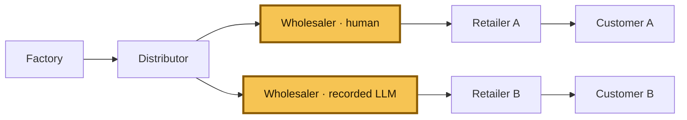

# Beer Distribution Game

**[▶ Play the Beer Distribution Game](https://beer-distribution-game.pages.dev/)**

This repository studies a simple question: what happens when a wholesaler has to
make replenishment decisions with delayed shipments, incomplete information, and
competing retailers?

The environment is deterministic and replayable, so the same seed and orders
always produce the same trajectory. It supports both classical multi-agent RL
experiments and tool-using LLM evaluations.



The two highlighted boxes are alternative wholesaler runs on the same seed: the
human game and the recorded LLM comparison. In the underlying Y topology there
is one wholesaler seat; the second box makes the comparison explicit rather than
implying that both agents play simultaneously.

## The fixed evaluation condition

### Public browser game + live-Y research (current)

The Cloudflare / Hugging Face static game and the live-Y research board use:

- Y-shaped supply chain, controlled role: **wholesaler only**
- 36 decision weeks, followed by deterministic settlement
- integer orders from 0 through 128
- one-week order delay and two-week shipment delay
- **factory capacity 400** (feasible upstream supply; research prompts still
  withhold the capacity number)
- local observations only; no private retailer state or future demand

### Frozen Hub Tier-5 (Prime Intellect / Verifiers)

The published Verifiers Hub package in
[`environments/beer_distribution_game/`](environments/beer_distribution_game/)
keeps the **calibrated Tier-5 capacity of 22** for historical leaderboard
parity. Do not mix Hub scores with the capacity-400 live-Y board.

Every action is `place_order(quantity)`. The player or model minimizes local
holding and backlog cost, not a system-wide score.

## Live game and anonymous baseline

The browser game is a dependency-free static app. Seat selection is locked to
the **wholesaler**. It uses opaque seeds, shows only the observation available
to the model, and reveals comparisons after week 36. Optional telemetry is
fail-soft and stores an anonymous session UUID plus replay-verified actions,
weekly state, and scores.

- [Play on Cloudflare Pages](https://beer-distribution-game.pages.dev/)
- [Open the Hugging Face Static Space](https://constantinertel-beer-distribution-game.static.hf.space/)
- [Deployment and operations guide](DEPLOY.md)

## What is in the repo

| Path | Purpose |
|---|---|
| [`static_web/`](static_web/) | JS simulator, browser UI, D1 Worker, and parity tests |
| `beer_distribution_rl/` | Classical simulator, RL agents, and wrappers |
| `environments/beer_distribution_game/` | Frozen Verifiers / Prime Intellect Hub environment (Tier-5 capacity **22**) |
| [`artifacts/live_y_capacity_400/`](artifacts/live_y_capacity_400/) | Current live-Y OpenRouter evals + hindsight-perfect board |
| [`artifacts/hub_llm/`](artifacts/hub_llm/) | Recorded Hub LLM traces and compact results |
| `tests/` | Python simulator, Hub, calibration, and regression tests |
| `docs/` | Frozen environment, reward, and difficulty specifications |

## Benchmark (capacity 400)

One evaluation condition for the live Tier-5 Y research board under **factory
capacity 400**: each policy controls the **wholesaler** for 36 weeks under the
research prompt (no demand law, no factory capacity disclosed). We use the same
16 fixed seeds in
[`experiments/live_y_domain_randomized_grpo_v1/seed_manifest.json`](experiments/live_y_domain_randomized_grpo_v1/seed_manifest.json).
Demand traces are CRN-determined by seed; hindsight search finds a feasible
minimum local cost for each seed.

Score is the percentage of that **hindsight-perfect** local cost:

`score = 100 × hindsight_perfect_mean_cost / policy_mean_cost`

Thus **100%** means matching the best open-loop wholesaler sequence found for
the fixed demand/counterparties. Adaptive base-stock is **not** perfect: its
mean local cost is **388.84** versus a hindsight-perfect mean of **287.22**
(~1.35×). Protocol-failed episodes are excluded from a model's mean.

| Model | Mean local cost | Score / 100 | Clean episodes |
| --- | ---: | ---: | ---: |
| Laguna S 2.1 (free) | 2,584.43 ± 825.89 | 14.02 | 7/16 |
| DeepSeek V4 Flash | 4,031.28 ± 882.47 | 7.12 | 16/16 |
| Nemotron 3 Ultra (free) | 5,379.00 ± 4,260.00 | 6.56 | 2/16 |


Artifacts:
[`artifacts/live_y_capacity_400/evaluations/`](artifacts/live_y_capacity_400/evaluations/)
(`hindsight_perfect_costs.json`, OpenRouter rows, `perfect_cost_leaderboard_capacity_400.json`).

Design note for the feasible-supply amendment:
[`experiments/live_y_feasible_supply_grpo_v2/DESIGN.md`](experiments/live_y_feasible_supply_grpo_v2/DESIGN.md).

### Historical capacity-22 board (archive)

An earlier live-Y board under **capacity 22** (perfect ≈ **720.88**, adaptive ≈
**783.59**) remains in
[`artifacts/live_y_domain_randomized_grpo_v1/`](artifacts/live_y_domain_randomized_grpo_v1/)
and
[`docs/assets/live-y-domain-randomized-benchmark.svg`](docs/assets/live-y-domain-randomized-benchmark.svg).
Those numbers are **not comparable** to the capacity-400 board above.

A separate frozen **serial** 100-seed board (naive-anchored score, 20 weeks)
remains in [`docs/assets/wholesaler-lora-benchmark.svg`](docs/assets/wholesaler-lora-benchmark.svg)
and [`eval/held_out_seeds.json`](eval/held_out_seeds.json); it is not mixed into
the live-Y dashboard.

## Teacher-free Qwen LoRA — live Tier-5 Y research run

The repository contains a teacher-free development research run for
`Qwen/Qwen3.5-4B` under the **capacity-22** information/scarcity contract (see
the archive board). Retraining under capacity 400 is tracked in
[`experiments/live_y_feasible_supply_grpo_v2/`](experiments/live_y_feasible_supply_grpo_v2/).

The complete capacity-22 experiment bundle, including LoRA adapters, is in
[`artifacts/live_y_domain_randomized_grpo_v1/`](artifacts/live_y_domain_randomized_grpo_v1/).
The 9.3 GB base checkpoint is kept locally in
`local_checkpoints/qwen35-4b-base/` and is intentionally not committed to
GitHub. Recreate it with:

```bash
hf download Qwen/Qwen3.5-4B --local-dir local_checkpoints/qwen35-4b-base
```

### How the score works

The live-Y dashboard score is anchored to a **hindsight-perfect** wholesaler
cost computed on each fixed seed after demand and scripted counterparties are
frozen:

`score = 100 × hindsight_perfect_mean_cost / policy_mean_cost`

Perfect costs are produced by
[`scripts/compute_live_y_hindsight_perfect.py`](scripts/compute_live_y_hindsight_perfect.py)
(order-up-to / tuned-adaptive grids, model warm starts, coordinate descent).
The reported perfect value is a feasible upper bound on the true optimum.
Adaptive base-stock remains available as a reporting heuristic only.

Weekly local cost is `0.5 × inventory + 1.0 × backlog`. Episode cost sums
36 operational weeks, 3 settlement weeks, and a terminal inventory-position
exposure charge.

### How we kept compute cheap

Training and eval stay lean without changing the information contract:

- **Prefix-only KV reuse** — `PrefixKVCache` caches the shared system /
  chat-template prefix across weeks in a batch; observations and history stay
  uncached because they change every turn. The cache is dropped after each
  optimizer step.
- **Short generations** — one JSON quantity, thinking disabled, a 32-token
  decode cap in training, and a bounded rolling history instead of a growing
  transcript.
- **Small updates, no critic** — LoRA + bf16 + gradient checkpointing; group
  baselines and CRN seeds cut variance so we do not train a value head.
- **API eval reuse** — OpenRouter runs use sticky `session_id` and system
  `cache_control` so the long invariant prompt is billed once per session.

Details and non-goals (compile, vLLM, full cross-week KV) are in
[`docs/LIVE_Y_EFFICIENCY.md`](docs/LIVE_Y_EFFICIENCY.md).

## Run it locally

Run the Python environment and its tests:

```bash
python -m pip install -e ".[dev]"
python -m pytest -q
```

Run the static app checks and builds:

```bash
npm ci
npm run test:all
npm run check:worker
npm run build
```

The build writes `dist/cloudflare-pages/` and `dist/huggingface-space/`.
GitHub Actions runs the Python suite, JS parity and UI tests, local Worker/D1
tests, Worker dry-run validation, and both static builds on every push and pull
request.

## Reproducibility

- Seeds use stable SHA-256 derivation; no runtime hash randomization is involved.
- The JS port matches the frozen Python environment week by week and at final
  grading.
- Invalid actions do not mutate state or consume randomness.
- Recorded traces replay to their published costs and rewards.
- Normative Hub Tier-5 source-of-truth files keep capacity **22**; public play
  and live-Y research override capacity to **400**.

See the frozen specifications for the exact Hub contract:

- [`docs/ENVIRONMENT_SPEC.md`](docs/ENVIRONMENT_SPEC.md)
- [`docs/REWARD_SPEC.md`](docs/REWARD_SPEC.md)
- [`docs/DIFFICULTY_LADDER.md`](docs/DIFFICULTY_LADDER.md)
- [`DECISIONS.md`](DECISIONS.md)

MIT licensed. No API keys are stored in the repository.
