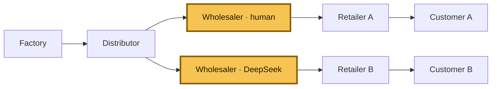

# Beer Distribution Game

**[▶ Play the live wholesaler game](https://beer-distribution-game.pages.dev/)**

This repository studies a simple question: what happens when a wholesaler has to
make replenishment decisions with delayed shipments, incomplete information, and
competing retailers?

The environment is deterministic and replayable, so the same seed and orders
always produce the same trajectory. It supports both classical multi-agent RL
experiments and tool-using LLM evaluations.



The two highlighted boxes are alternative wholesaler runs on the same seed: the
human game and the recorded DeepSeek comparison. In the underlying frozen Y
topology there is one wholesaler seat; the second box makes the comparison
explicit rather than implying that both agents play simultaneously.

## The fixed evaluation condition

The public human game and the headline LLM comparison use the same Tier 5 setup:

- Y-shaped supply chain, controlled role: **wholesaler**
- 36 decision weeks, followed by deterministic settlement
- integer orders from 0 through 128
- one-week order delay and two-week shipment delay
- factory capacity of 22 with proportional allocation under shortage
- local observations only; no private retailer state or future demand
- comparison against the recorded DeepSeek V4 Flash trace and adaptive base-stock
  policy for the same seed

Every action is `place_order(quantity)`. The player or model minimizes local
holding and backlog cost, not a system-wide score.

## Live game and anonymous baseline

The browser game is a dependency-free static app. It uses eight opaque development
and validation seeds, shows only the observation available to the model, and
reveals comparisons after week 36. Optional telemetry is fail-soft and stores an
anonymous session UUID plus replay-verified actions, weekly state, and scores.

- [Play on Cloudflare Pages](https://beer-distribution-game.pages.dev/)
- [Open the Hugging Face Static Space](https://constantinertel-beer-distribution-game.static.hf.space/)
- [Deployment and operations guide](DEPLOY.md)

## What is in the repo

| Path | Purpose |
|---|---|
| [`static_web/`](static_web/) | JS simulator, browser UI, D1 Worker, and parity tests |
| `beer_distribution_rl/` | Classical simulator, RL agents, and wrappers |
| `environments/beer_distribution_game/` | Frozen Verifiers Hub environment |
| [`artifacts/hub_llm/`](artifacts/hub_llm/) | Recorded LLM traces and compact results |
| `tests/` | Python simulator, Hub, calibration, and regression tests |
| `docs/` | Frozen environment, reward, and difficulty specifications |

## Current wholesaler result

These are development results, not held-out benchmark claims. Across three Tier 5
development seeds, the recorded DeepSeek wholesaler run had average local cost
**1,111.8 ± 213.2**, compared with **850.7 ± 326.1** for the paired adaptive
base-stock policy. The negative result is useful: it gives the project a clear
wholesaler learning target rather than hiding an inconvenient comparison.

The replayable source data is in
[`artifacts/hub_llm/deepseek_v4_flash/v0_2_wholesaler_y_development/`](artifacts/hub_llm/deepseek_v4_flash/v0_2_wholesaler_y_development/).

## Run it locally

Run the Python environment and its tests:

```bash
python -m pip install -e ".[dev]"
python -m pytest -q
```

Run the static app checks and builds:

```bash
npm ci
npm run test:all
npm run check:worker
npm run build
```

The build writes `dist/cloudflare-pages/` and `dist/huggingface-space/`.
GitHub Actions runs the Python suite, JS parity and UI tests, local Worker/D1
tests, Worker dry-run validation, and both static builds on every push and pull
request.

## Reproducibility

- Seeds use stable SHA-256 derivation; no runtime hash randomization is involved.
- The JS port matches the frozen Python environment week by week and at final
  grading.
- Invalid actions do not mutate state or consume randomness.
- Recorded traces replay to their published costs and rewards.
- Normative source-of-truth files are not changed by the web app.

See the frozen specifications for the exact contract:

- [`docs/ENVIRONMENT_SPEC.md`](docs/ENVIRONMENT_SPEC.md)
- [`docs/REWARD_SPEC.md`](docs/REWARD_SPEC.md)
- [`docs/DIFFICULTY_LADDER.md`](docs/DIFFICULTY_LADDER.md)
- [`DECISIONS.md`](DECISIONS.md)

MIT licensed. No API keys are stored in the repository.
