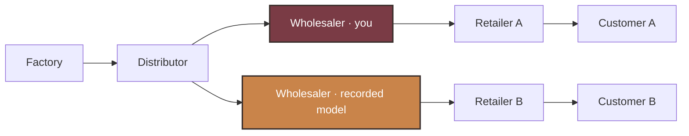
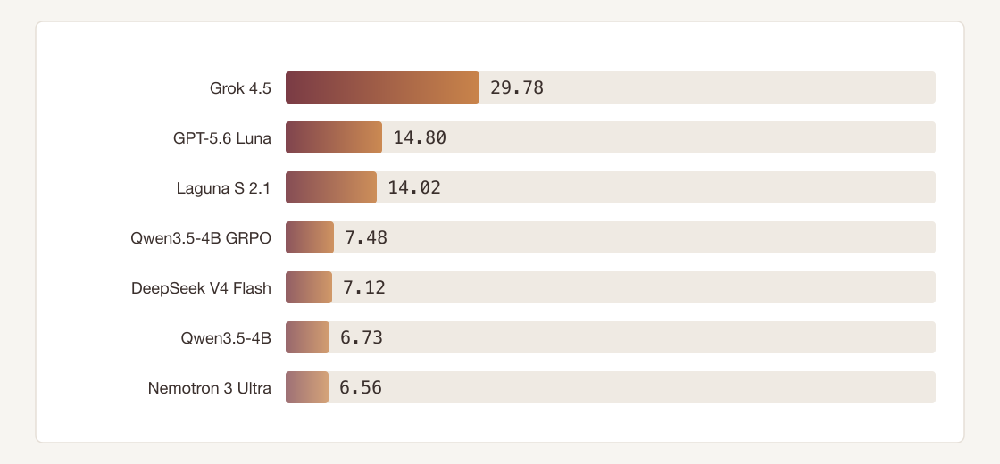

# Beer Distribution Game

[▶ Play](https://beer-distribution-game.pages.dev/)

A stochastic Y-network beer game for ordering agents under delayed shipments and
fog-of-war. Public play and the live-Y research board use factory capacity
400 with the wholesaler seat locked; fixed held-out seeds score policies
against a hindsight-perfect cost reference.



The playable board highlights two wholesalers: you and the sealed recorded-model
companion on the same seed (same station pair as the static game UI). Underneath,
the Y DAG still has one wholesaler seat feeding Retailer A/B; the second card is
the parallel comparison episode, not a second live seat.

## Benchmark (capacity 400)

Sixteen fixed live-Y seeds; research prompt withholds demand law and capacity.
Protocol-failed episodes are dropped from each model mean.



Artifacts: [`artifacts/live_y_capacity_400/evaluations/`](artifacts/live_y_capacity_400/evaluations/).

### Scoring

Weekly local cost (holding $0.5$, backlog $1.0$):

$$
c_t = 0.5\, I_t + 1.0\, B_t
$$

Episode cost over $H=36$ decision weeks, $3$ settlement weeks, and terminal
inventory-position charge ($O$ = on-order pipeline):

$$
\begin{aligned}
IP &= I + O - B \\
c^{\mathrm{term}} &= 0.5\max(IP,0) + 1.0\max(-IP,0) \\
C &= \sum_{t=1}^{H} c_t + \sum_{t=H+1}^{H+3} c_t + c^{\mathrm{term}}
\end{aligned}
$$

Hindsight-perfect $C^*$ is a feasible open-loop upper bound on each CRN seed
($\overline{C^*} = 287.22$; adaptive base-stock averages $388.84$). Score on
protocol-valid episodes:

$$
\mathrm{score} = 100 \times \frac{\overline{C^*}}{\overline{C_{\mathrm{policy}}}}
$$

## Qwen fine-tune (live-Y GRPO v1)

[`scripts/train_live_y_domain_randomized_grpo_v1.py`](scripts/train_live_y_domain_randomized_grpo_v1.py)
trains a LoRA adapter on `Qwen/Qwen3.5-4B` with critic-free multi-turn
group-relative updates (GRPO-style). Demand is
`episode_randomized_y_poisson_v1`: per episode, $\lambda \sim \mathcal{U}[2,8]$, then
independent Poisson draws for each retailer; groups share CRN seeds.

Per-turn return-to-go from local wholesaler cost (plus settlement / terminal
exposure); protocol failure adds $-10^{5}$ at the failing turn:

$$
G_{i,t} = -\sum_{u \ge t} c_{i,u} + \text{(settlement / terminal)}
$$

Same-timestep group baseline (no variance normalization):

$$
A_{i,t} = G_{i,t} - \frac{1}{|g|}\sum_{j \in g} G_{j,t}
$$

Clipped importance-ratio objective (from the shared trainer):

$$
\mathcal{L} = -\mathbb{E}\Big[\min\big(r A,\; \mathrm{clip}(r, 1-\varepsilon, 1+\varepsilon)\, A\big)\Big],
\quad r = \exp(\ell_{\theta} - \ell_{\mathrm{old}})
$$

with $\varepsilon = 0.2$. Research capacity is 400; Hub Tier-5 stays 22.

## Hyperefficient compute

Documented in [`docs/LIVE_Y_EFFICIENCY.md`](docs/LIVE_Y_EFFICIENCY.md):

- Prefix KV cache across shared chat-template tokens; invalidate after each LoRA update
- Batched rollouts; separate inference / train minibatches; LoRA + bf16 + gradient checkpointing
- Bounded JSON completions (32-token train cap); rolling history window, not full transcript
- `torch.inference_mode` for generation / old-policy scoring; critic-free group baselines (no value net)
- CRN / fixed seed derivation to cut rollout variance

## How it is built

| Layer | Role |
| --- | --- |
| Python oracle (`environments/…/core.py`, research env) | Seeded simulator + grader |
| [`static_web/`](static_web/) | Browser JS port, parity-checked against the oracle |
| [`beer_distribution_rl/`](beer_distribution_rl/) | Research protocol, agents, GRPO / eval harness |
| [`environments/beer_distribution_game/`](environments/beer_distribution_game/) | Verifiers Hub package (Tier-5 capacity 22) |

## Links

[Hugging Face Space](https://constantinertel-beer-distribution-game.static.hf.space/) · [Deploy](DEPLOY.md)

## Run locally

```bash
python -m pip install -e ".[dev]"
python -m pytest -q
npm ci && npm run test:all && npm run build
```
