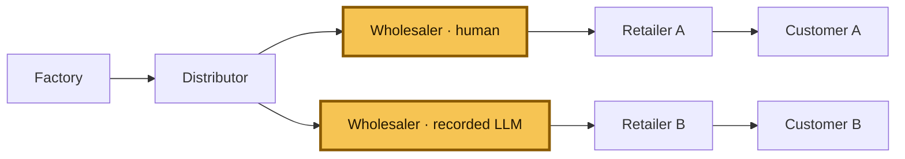
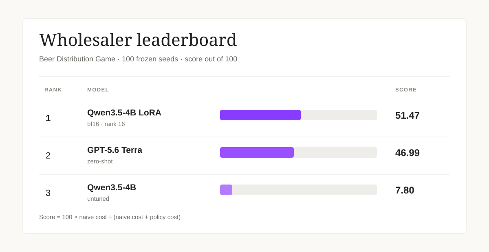

# Beer Distribution Game

**[▶ Play the redesigned Beer Distribution Game](https://beer-distribution-game.pages.dev/)**

This repository studies a simple question: what happens when a wholesaler has to
make replenishment decisions with delayed shipments, incomplete information, and
competing retailers?

The environment is deterministic and replayable, so the same seed and orders
always produce the same trajectory. It supports both classical multi-agent RL
experiments and tool-using LLM evaluations.



The two highlighted boxes are alternative wholesaler runs on the same seed: the
human game and the recorded LLM comparison. In the underlying frozen Y
topology there is one wholesaler seat; the second box makes the comparison
explicit rather than implying that both agents play simultaneously.

## The fixed evaluation condition

The public human game and the headline LLM comparison use the same Tier 5 setup:

- Y-shaped supply chain, controlled role: **wholesaler**
- 36 decision weeks, followed by deterministic settlement
- integer orders from 0 through 128
- one-week order delay and two-week shipment delay
- factory capacity of 22 with proportional allocation under shortage
- local observations only; no private retailer state or future demand
- comparison against the recorded LLM trace and adaptive base-stock
  policy for the same seed

Every action is `place_order(quantity)`. The player or model minimizes local
holding and backlog cost, not a system-wide score.

## Live game and anonymous baseline

The browser game is a dependency-free static app. It uses eight opaque development
and validation seeds, shows only the observation available to the model, and
reveals comparisons after week 36. Optional telemetry is fail-soft and stores an
anonymous session UUID plus replay-verified actions, weekly state, and scores.

- [Play on Cloudflare Pages](https://beer-distribution-game.pages.dev/)
- [Open the Hugging Face Static Space](https://constantinertel-beer-distribution-game.static.hf.space/)
- [Deployment and operations guide](DEPLOY.md)

## What is in the repo

| Path | Purpose |
|---|---|
| [`static_web/`](static_web/) | JS simulator, browser UI, D1 Worker, and parity tests |
| `beer_distribution_rl/` | Classical simulator, RL agents, and wrappers |
| `environments/beer_distribution_game/` | Frozen Verifiers Hub environment |
| [`artifacts/hub_llm/`](artifacts/hub_llm/) | Recorded LLM traces and compact results |
| `tests/` | Python simulator, Hub, calibration, and regression tests |
| `docs/` | Frozen environment, reward, and difficulty specifications |

## Benchmark

One evaluation condition, one leaderboard. Each policy controls the
**wholesaler** for 20 weeks in the native serial Beer Game; the retailer,
distributor, and factory use fixed base-stock policies. We run every policy on
the same 100 frozen demand sequences in
[`eval/held_out_seeds.json`](eval/held_out_seeds.json), sum supply-chain holding
and backlog cost within each episode, then report the mean and standard error.
An invalid model answer is recorded as order zero and a format failure.

| Model | Mean total cost | Score / 100 | Bullwhip | Format failures |
| --- | ---: | ---: | ---: | ---: |
| Qwen3.5-4B (untuned) | 20,452.36 ± 13.18 | 7.80 | 1.821 | 0.0% |
| Qwen3.5-4B + LoRA | 1,632.25 ± 40.99 | 51.47 | 1.821 | 0.0% |
| Claude Opus 5 (zero-shot) | 1,754.48 ± 61.14 | 49.66 | 1.821 | 0.0% |



## Teacher-free Qwen LoRA — live Tier-5 Y research run

The repository also contains a separate development research run for
`Qwen/Qwen3.5-4B`, using 16 train-only seeds and 16 fixed research evaluation
seeds. It used bf16 rank-16 LoRA, per-turn return-to-go group-relative
advantages, and no teacher demonstrations or base-stock actions. Mean local
wholesaler cost was **1,538.47 ± 312.27** for the untuned base and
**1,120.72 ± 240.84** after LoRA; all evaluated episodes were protocol-clean.

For this research arm, adaptive base-stock is the operational optimal-cost
reference. Its score is the percentage of that reference cost achieved by the
policy:

`optimal_cost_percentage = 100 × optimal_reference_mean_cost / policy_mean_cost`

Thus **100%** means matching the reference cost; lower percentages mean higher
cost. On the fixed 16-seed evaluation, the base scored **50.93%** of optimal
cost and the final LoRA scored **69.92%**. This is separate from the
naive-anchored score used by the frozen benchmark above; the adaptive reference
is operational and is not a formal proof of global optimality.

The complete experiment bundle, including both LoRA adapter weight files,
tokenizers, rollouts, logs, evaluations, configs, billing, and checksums, is in
[`artifacts/live_y_domain_randomized_grpo_v1/`](artifacts/live_y_domain_randomized_grpo_v1/).
The 9.3 GB base checkpoint is kept locally in
`local_checkpoints/qwen35-4b-base/` and is intentionally not committed to
GitHub. Recreate it with:

```bash
hf download Qwen/Qwen3.5-4B --local-dir local_checkpoints/qwen35-4b-base
```

### How the score works

The 0–100 score is deliberately anchored to a simple, non-model policy that
orders what it observed last period:

`score = 100 × naive_mean_cost / (naive_mean_cost + policy_mean_cost)`

The naive policy's mean cost is 1,730.82, so it scores exactly 50. A policy
with zero cost approaches 100; a policy worse than naive remains above zero
rather than being clipped. This makes the score stable and easy to compare
without claiming a theoretical "perfect" Beer Game solution. The base-stock
level is tuned only on training seeds; the held-out sequences are never used
for training, synthetic data generation, or calibration.

Qwen uses a bf16 rank-16 LoRA adapter with alpha 16 on
`q_proj`, `k_proj`, `v_proj`, `o_proj`, `gate_proj`, `up_proj`, and `down_proj`.
Claude Opus 5 is a zero-shot OpenRouter policy. To keep the frontier run small,
we send only a compact state tuple, require a one-field JSON order, disable
reasoning, cap output at 16 tokens, deduplicate identical same-week states, and
cache deterministic API responses for restart-safe reruns. Full protocol and
raw metrics live in [results/README.md](results/README.md).

Earlier live-Y and robustness experiments remain in the repository as
supplementary artifacts, but are intentionally not mixed into this leaderboard.

## Run it locally

Run the Python environment and its tests:

```bash
python -m pip install -e ".[dev]"
python -m pytest -q
```

Run the static app checks and builds:

```bash
npm ci
npm run test:all
npm run check:worker
npm run build
```

The build writes `dist/cloudflare-pages/` and `dist/huggingface-space/`.
GitHub Actions runs the Python suite, JS parity and UI tests, local Worker/D1
tests, Worker dry-run validation, and both static builds on every push and pull
request.

## Reproducibility

- Seeds use stable SHA-256 derivation; no runtime hash randomization is involved.
- The JS port matches the frozen Python environment week by week and at final
  grading.
- Invalid actions do not mutate state or consume randomness.
- Recorded traces replay to their published costs and rewards.
- Normative source-of-truth files are not changed by the web app.

See the frozen specifications for the exact contract:

- [`docs/ENVIRONMENT_SPEC.md`](docs/ENVIRONMENT_SPEC.md)
- [`docs/REWARD_SPEC.md`](docs/REWARD_SPEC.md)
- [`docs/DIFFICULTY_LADDER.md`](docs/DIFFICULTY_LADDER.md)
- [`DECISIONS.md`](DECISIONS.md)

MIT licensed. No API keys are stored in the repository.
