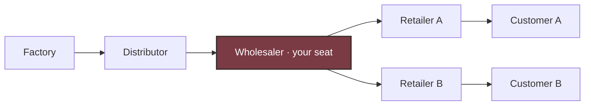
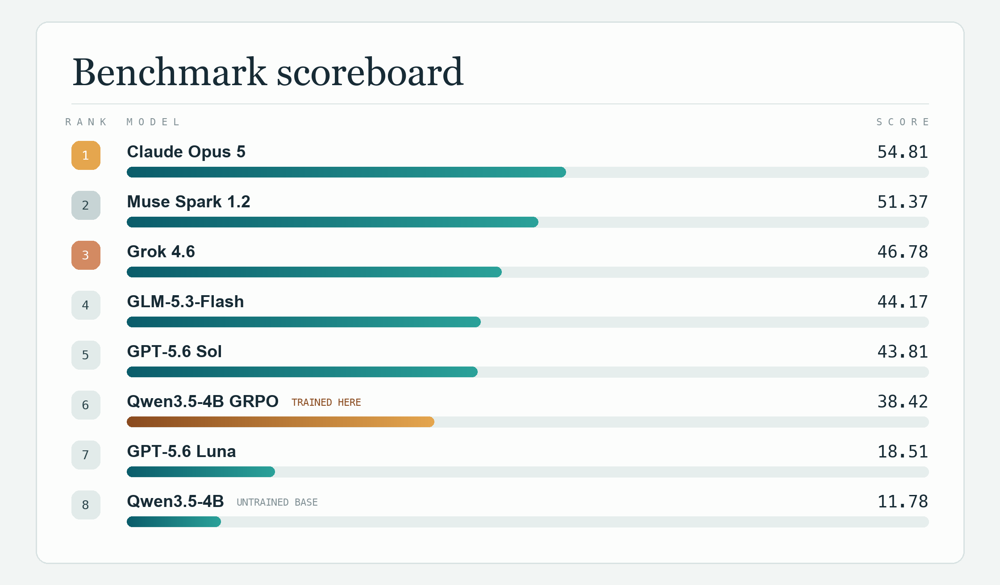
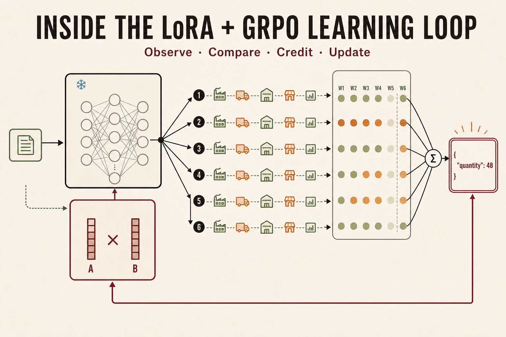

# Supply Chain RL Environment & Benchmark (SupplyChainBench)

**[▶ Play the corrected stochastic v2 game](https://constantinvictorbeatertel.github.io/Supply_Chain_Bench/)**

**Can an AI agent learn to control a delayed, partially observed system?**

SupplyChainBench measures long-horizon decision-making under hidden and changing
dynamics through the beer distribution game. In the beer supply chain distribution game, an agent runs the wholesaler for 36 weeks.
Orders and shipments take time, mistakes are only visible weeks later, and the
agent is not told the demand law or supply limits.

The project measures three things:

- **Control:** can the agent keep inventory and backlog costs low?
- **Adaptation:** can it recover when demand, delays, or supply change?
- **Learning:** does improvement come from a bounded notebook or real LoRA
  weight updates across episodes?

## Motivation

One central pillar that our personal lives, as well as society, rest on is the ability to forecast the future.
This is inherently difficult because the future is unknown. Doing it well requires pulling together context, determining what information matters, and understanding how actions today can affect outcomes much later.

I wanted to build a task that could both **test and teach** this kind of long-horizon reasoning. I thought back to the Beer Distribution Game from a supply chain class I had taken.

The game is particularly useful because of its delays. Orders and shipments take time to arrive, so an action that looks reasonable today may create excess inventory or backlog several weeks later. To perform well, an agent has to think ahead while simultaneously accounting for decisions already moving through the supply chain.

SupplyChainBench turns that idea into an RL environment and benchmark. An agent controls the wholesaler for 36 weeks without being told the underlying demand law or supply limits, and is evaluated on its ability to control costs, adapt when the environment changes, and learn across episodes.

For training, I use **GRPO + LoRA**. GRPO compares sampled actions against other rollouts, while LoRA efficiently updates the policy without changing the frozen Qwen3.5-4B base model. Because an order's effects are delayed, each decision is scored using a six-week downstream cost window.

The v1-trained adapter also transfers substantially better than its base model
to v2. On the same 16 held-out v2 benchmark seeds, Qwen3.5-4B improves from a
score of **11.78 untrained to 38.42 with the v1-trained adapter**, while mean
cost falls from **4,742.3 to 1,453.6**. The earlier **6.73 to 20.64** result
remains archived as a v1 result; the adapter has not yet been retrained on v2.

The broader goal is not only to benchmark supply-chain reasoning, but to explore whether environments with **delayed consequences and long horizons can train more general decision-making abilities.**

## Benchmark

The main test uses 16 fixed supply chains. The agent controls the wholesaler
without being told the demand pattern or supply limit.

Five additional tests change demand, delivery times, or supply to see whether
the agent notices and recovers. Separate experiments compare starting fresh,
carrying short notes between games, and updating model weights. Their scores
stay separate so unlike tests are not compared directly.

The browser replay preserves the historical baseline, untrained-model, and
trained-model comparison. The playable game now runs the corrected stochastic
v2 training scenario: every new game gets a fresh seed, customer demand is
sampled each retailer/week, and retailer orders carry that demand variation to
the wholesaler. The end screen compares the human with an adaptive base-stock
policy on the exact same episode seed; model results are evaluated separately
on the frozen v2 benchmark seeds.

The chain is a Y: one wholesaler splitting a single inventory pool between
two retailers who compete for it.



The playable wholesaler sees the combined orders placed by the two retailers,
not privileged end-customer demand. In v2, each retailer orders its newly sampled
customer demand plus the fixed scarcity increment. That preserves fog of war
without collapsing the wholesaler's incoming signal to a constant value.

The archived v1 model results remain reproducible and are not presented as v2
game comparisons. The current model comparison uses
`live-y-domain-randomized-grpo-v2`: evaluation calls the same `training_spec`
constructor as training, while browser play is parity-tested against those v2
dynamics. Evaluation uses separate held-out seeds.

## Technical benchmark details

36 weeks each, factory capacity 400. Every v2 episode resamples customer demand,
and the LLM prompt withholds the demand law and the capacity.

Official v2 scores require all 16 held-out episodes to finish protocol-clean.
The primary score pairs every model episode with the best feasible hindsight
cost found for the exact same seed:

$$
\mathrm{score} = 100 \times
\frac{\sum_s C^{\mathrm{best\ found}}_s}
     {\sum_s C^{\mathrm{policy}}_s}
$$

| Rank | Model | Score | 95% paired-bootstrap CI | Mean cost |
| ---: | --- | ---: | ---: | ---: |
| 1 | Muse Spark 1.2 | **51.37** | 46.39–55.93 | 1,087.2 |
| 2 | Grok 4.6 | **46.78** | 44.56–48.95 | 1,193.8 |
| 3 | GLM-5.3-Flash | **44.17** | 39.18–49.47 | 1,264.4 |
| 4 | GPT-5.6 Sol | **43.81** | 37.61–50.62 | 1,274.8 |
| 5 | Qwen3.5-4B GRPO (v1-trained) | **38.42** | 35.66–41.69 | 1,453.6 |
| 6 | GPT-5.6 Luna | **18.51** | 15.31–23.21 | 3,016.2 |
| 7 | Qwen3.5-4B (untrained) | **11.78** | 9.41–14.72 | 4,742.3 |

The v2 best-found hindsight mean cost is 558.44 and the adaptive base-stock
mean is 802.53 (score 69.58). The hindsight search is a feasible reference, not
a proof of mathematical optimality. DeepSeek V4 Flash and Grok 4.5 each had one
protocol failure and remain unranked; incomplete Claude, Laguna, and Nemotron
runs are also unranked. Full replayable artifacts and coverage are in
[`artifacts/live_y_domain_randomized_grpo_v2/evaluations/`](artifacts/live_y_domain_randomized_grpo_v2/evaluations/).

### Archived v1 benchmark



For reference on the same seeds: hindsight-perfect scores 100, an adaptive
base-stock heuristic 73.9, and the best blind constant-order policy — order 18
every week, never reading the observation — 19.8.

Artifacts: [`artifacts/live_y_capacity_400/evaluations/`](artifacts/live_y_capacity_400/evaluations/).
The chart is generated from the leaderboard JSON by
[`scripts/render_capacity_400_scoreboard.py`](scripts/render_capacity_400_scoreboard.py),
so it cannot drift from the evaluations.

### Archived v1 scoring

Weekly local cost (holding $0.5$, backlog $1.0$):

$$
c_t = 0.5\, I_t + 1.0\, B_t
$$

Episode cost over $H=36$ decision weeks, $3$ settlement weeks, and terminal
inventory-position charge ($O$ = on-order pipeline):

$$
\begin{aligned}
IP &= I + O - B \\
c^{\mathrm{term}} &= 0.5\max(IP,0) + 1.0\max(-IP,0) \\
C &= \sum_{t=1}^{H} c_t + \sum_{t=H+1}^{H+3} c_t + c^{\mathrm{term}}
\end{aligned}
$$

Hindsight-perfect $C^{\star}$ is a feasible open-loop upper bound on each CRN seed.
Across all 16 seeds the reference means are:

$$
\overline{C^{\star}} = 287.22,
\qquad
\text{adaptive base-stock average} = 388.84
$$

Both means are taken over the same protocol-clean subset $S$ of the 16 seeds, so
a model that fails episodes is scored against the perfect reference for the
seeds it actually finished:

$$
\mathrm{score} = 100 \times
\frac{\frac{1}{|S|}\sum_{s \in S} C^{\star}_{s}}
     {\frac{1}{|S|}\sum_{s \in S} C^{\mathrm{policy}}_{s}}
$$

For every model that finished all 16 the numerator is the 287.22 above. The
latest fully clean API runs score 43.61 for GPT-5.6 Sol and 42.09 for Grok 4.6.
Runs with any protocol failure are diagnostic and remain unranked on the
canonical board: Claude Opus 5 completed 15/16 clean (diagnostic score 51.28),
the DeepSeek V4 Flash 0731 rerun completed 11/16 (7.28), and Muse Spark 1.2
completed 0/16 (no score). The previously published fully clean DeepSeek run
remains ranked at 7.12. Laguna (7/16 clean) and Nemotron (2/16) are likewise
small-sample diagnostics.

## Qwen fine-tune (live-Y GRPO v1)

**[▶ Explore the LoRA + GRPO learning loop](https://constantinvictorbeatertel.github.io/Supply_Chain_Bench/lora-grpo/)**

<p align="center">
  <a href="https://constantinvictorbeatertel.github.io/Supply_Chain_Bench/lora-grpo/">
    
  </a>
</p>

*GRPO supplies the comparison and credit-assignment objective; LoRA is the
trainable parameterization that receives those gradients while the base model
stays frozen.*

[`scripts/train_live_y_domain_randomized_grpo_v1.py`](scripts/train_live_y_domain_randomized_grpo_v1.py)
trains a LoRA adapter on `Qwen/Qwen3.5-4B` with critic-free multi-turn
group-relative updates (GRPO-style). The Qwen base stays frozen; only a rank-16
LoRA adapter on the attention and MLP projections is optimized.

Each update rolls out 8 matched seeds 6 times, scores every order against its
groupmates using a 6-week downstream-cost window, and applies a clipped
token-level update to the digits in `{"quantity": N}`. In short, GRPO decides
which sampled actions were better; LoRA is the small set of weights changed to
make those actions more likely.

Full details: [`docs/TRAINING.md`](docs/TRAINING.md) ·
[`docs/LIVE_Y_RL_POSTMORTEM.md`](docs/LIVE_Y_RL_POSTMORTEM.md) ·
[`artifacts/live_y_best_adapter/`](artifacts/live_y_best_adapter/)

## Hyperefficient compute

Documented in [`docs/LIVE_Y_EFFICIENCY.md`](docs/LIVE_Y_EFFICIENCY.md):

- Prefix KV cache across shared chat-template tokens; invalidate after each LoRA update
- Batched rollouts; separate inference / train minibatches; LoRA + bf16 + gradient checkpointing
- Bounded JSON completions (32-token train cap); rolling history window, not full transcript
- `torch.inference_mode` for generation / old-policy scoring; critic-free group baselines (no value net)
- CRN / fixed seed derivation to cut rollout variance

## How it is built

| Layer | Role |
| --- | --- |
| Python oracle (`environments/…/core.py`, research env) | Seeded simulator + grader |
| [`static_web/`](static_web/) | Browser JS port, parity-checked against the oracle |
| [`beer_distribution_rl/`](beer_distribution_rl/) | Research protocol, agents, GRPO / eval harness |
| [`environments/beer_distribution_game/`](environments/beer_distribution_game/) | Verifiers Hub package (Tier-5 capacity 22) |

## Run locally

```bash
python -m pip install -e ".[dev,benchmark]"
python -m pytest -q
python -m supplychainbench.eval --model agent:constant-18 --suite standard
python -m supplychainbench.leaderboard
npm ci
npm run test:all
npm run build
```
