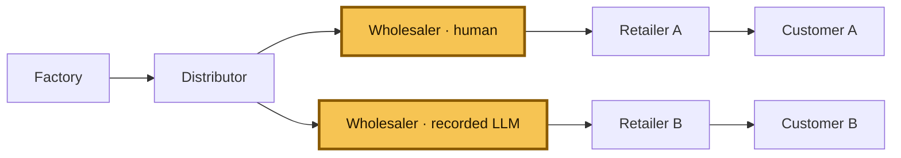
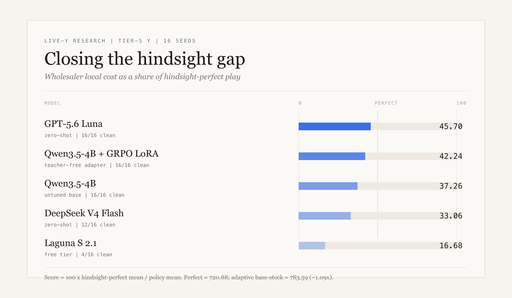

# Beer Distribution Game

**[▶ Play the redesigned Beer Distribution Game](https://beer-distribution-game.pages.dev/)**

This repository studies a simple question: what happens when a wholesaler has to
make replenishment decisions with delayed shipments, incomplete information, and
competing retailers?

The environment is deterministic and replayable, so the same seed and orders
always produce the same trajectory. It supports both classical multi-agent RL
experiments and tool-using LLM evaluations.



The two highlighted boxes are alternative wholesaler runs on the same seed: the
human game and the recorded LLM comparison. In the underlying frozen Y
topology there is one wholesaler seat; the second box makes the comparison
explicit rather than implying that both agents play simultaneously.

## The fixed evaluation condition

The public human game and the headline LLM comparison use the same Tier 5 setup:

- Y-shaped supply chain, controlled role: **wholesaler**
- 36 decision weeks, followed by deterministic settlement
- integer orders from 0 through 128
- one-week order delay and two-week shipment delay
- factory capacity of 22 with proportional allocation under shortage
- local observations only; no private retailer state or future demand
- comparison against the recorded LLM trace and adaptive base-stock
  policy for the same seed

Every action is `place_order(quantity)`. The player or model minimizes local
holding and backlog cost, not a system-wide score.

## Live game and anonymous baseline

The browser game is a dependency-free static app. It uses eight opaque development
and validation seeds, shows only the observation available to the model, and
reveals comparisons after week 36. Optional telemetry is fail-soft and stores an
anonymous session UUID plus replay-verified actions, weekly state, and scores.

- [Play on Cloudflare Pages](https://beer-distribution-game.pages.dev/)
- [Open the Hugging Face Static Space](https://constantinertel-beer-distribution-game.static.hf.space/)
- [Deployment and operations guide](DEPLOY.md)

## What is in the repo

| Path | Purpose |
|---|---|
| [`static_web/`](static_web/) | JS simulator, browser UI, D1 Worker, and parity tests |
| `beer_distribution_rl/` | Classical simulator, RL agents, and wrappers |
| `environments/beer_distribution_game/` | Frozen Verifiers Hub environment |
| [`artifacts/hub_llm/`](artifacts/hub_llm/) | Recorded LLM traces and compact results |
| `tests/` | Python simulator, Hub, calibration, and regression tests |
| `docs/` | Frozen environment, reward, and difficulty specifications |

## Benchmark

One evaluation condition for the live Tier-5 Y research board: each policy
controls the **wholesaler** for 36 weeks under the research prompt (no demand
law, no factory capacity). We use the same 16 fixed seeds in
[`experiments/live_y_domain_randomized_grpo_v1/seed_manifest.json`](experiments/live_y_domain_randomized_grpo_v1/seed_manifest.json).
Demand traces are CRN-determined by seed and were stored on every evaluation
row; hindsight search then finds a feasible minimum local cost for each seed.

Score is the percentage of that **hindsight-perfect** local cost:

`score = 100 × hindsight_perfect_mean_cost / policy_mean_cost`

Thus **100%** means matching the best open-loop wholesaler sequence found for
the fixed demand/counterparties. Adaptive base-stock is **not** perfect: its
mean local cost is 783.59 versus a hindsight-perfect mean of **720.88**
(~1.09×). Protocol-failed episodes are excluded from a model's mean.

| Model | Mean local cost | Score / 100 | Clean episodes |
| --- | ---: | ---: | ---: |
| GPT-5.6 Luna | 1,577.56 ± 412.22 | 45.70 | 16/16 |
| Qwen3.5-4B + GRPO LoRA | 1,706.81 ± 277.24 | 42.24 | 16/16 |
| Qwen3.5-4B (untuned) | 1,934.84 ± 299.83 | 37.26 | 16/16 |
| DeepSeek V4 Flash | 1,831.42 ± 407.82 | 33.06 | 12/16 |
| Laguna S 2.1 (free) | 1,132.88 ± 179.72 | 16.68 | 4/16 |



Hindsight perfect costs, rescored leaderboard, and per-seed action sequences
live in
[`artifacts/live_y_domain_randomized_grpo_v1/evaluations/`](artifacts/live_y_domain_randomized_grpo_v1/evaluations/).

A separate frozen **serial** 100-seed board (naive-anchored score, 20 weeks)
remains in [`docs/assets/wholesaler-lora-benchmark.svg`](docs/assets/wholesaler-lora-benchmark.svg)
and [`eval/held_out_seeds.json`](eval/held_out_seeds.json); it is not mixed into
the live-Y dashboard above.

## Teacher-free Qwen LoRA — live Tier-5 Y research run

The repository contains a teacher-free development research run for
`Qwen/Qwen3.5-4B`: 16 train-only seeds, 16 fixed research evaluation seeds,
bf16 rank-16 LoRA, and per-turn return-to-go group-relative advantages with no
teacher demonstrations. Under the **research prompt** (factory capacity
withheld), mean local wholesaler cost is **1,934.84 ± 299.83** for the untuned
base and **1,706.81 ± 277.24** after GRPO; both are 100% protocol-clean.

Scoring uses **hindsight-perfect** local cost on the stored/CRN demand traces,
not adaptive base-stock:

`score = 100 × hindsight_perfect_mean_cost / policy_mean_cost`

Hindsight perfect mean local cost across the 16 seeds is **720.88**; adaptive
base-stock averages **783.59** (~1.09× perfect), so adaptive is a strong
heuristic rather than the optimum. On this board the untuned base scores
**37.26%** of perfect and the final LoRA **42.24%**. GPT-5.6 Luna leads the
published comparison at **45.70%**. See the Benchmark section above for the
full five-model dashboard.

The complete experiment bundle, including both LoRA adapter weight files,
tokenizers, rollouts, logs, evaluations, configs, billing, and checksums, is in
[`artifacts/live_y_domain_randomized_grpo_v1/`](artifacts/live_y_domain_randomized_grpo_v1/).
The 9.3 GB base checkpoint is kept locally in
`local_checkpoints/qwen35-4b-base/` and is intentionally not committed to
GitHub. Recreate it with:

```bash
hf download Qwen/Qwen3.5-4B --local-dir local_checkpoints/qwen35-4b-base
```

### How the score works

The live-Y dashboard score is anchored to a **hindsight-perfect** wholesaler
cost computed on each fixed seed after demand and scripted counterparties are
frozen:

`score = 100 × hindsight_perfect_mean_cost / policy_mean_cost`

Perfect costs are produced by
[`scripts/compute_live_y_hindsight_perfect.py`](scripts/compute_live_y_hindsight_perfect.py)
(order-up-to / tuned-adaptive grids, model warm starts, coordinate descent).
The reported perfect value is a feasible upper bound on the true optimum.
Adaptive base-stock remains available as a reporting heuristic only.

Qwen uses a bf16 rank-16 LoRA adapter with alpha 16 on
`q_proj`, `k_proj`, `v_proj`, `o_proj`, `gate_proj`, `up_proj`, and `down_proj`.
The OpenRouter comparison models are zero-shot under the same research prompt
and parser. Full protocol artifacts live in
[`artifacts/live_y_domain_randomized_grpo_v1/`](artifacts/live_y_domain_randomized_grpo_v1/).

Earlier serial / frontier experiments remain in the repository as
supplementary artifacts, but are intentionally not mixed into this live-Y
dashboard.

### How we kept compute cheap

Training and eval stay lean without changing the information contract:

- **Prefix-only KV reuse** — `PrefixKVCache` caches the shared system /
  chat-template prefix across weeks in a batch; observations and history stay
  uncached because they change every turn. The cache is dropped after each
  optimizer step.
- **Short generations** — one JSON quantity, thinking disabled, a 32-token
  decode cap in training, and a bounded rolling history instead of a growing
  transcript.
- **Small updates, no critic** — LoRA + bf16 + gradient checkpointing; group
  baselines and CRN seeds cut variance so we do not train a value head.
- **API eval reuse** — OpenRouter runs use sticky `session_id` and system
  `cache_control` so the long invariant prompt is billed once per session.

Details and non-goals (compile, vLLM, full cross-week KV) are in
[`docs/LIVE_Y_EFFICIENCY.md`](docs/LIVE_Y_EFFICIENCY.md).

## Run it locally

Run the Python environment and its tests:

```bash
python -m pip install -e ".[dev]"
python -m pytest -q
```

Run the static app checks and builds:

```bash
npm ci
npm run test:all
npm run check:worker
npm run build
```

The build writes `dist/cloudflare-pages/` and `dist/huggingface-space/`.
GitHub Actions runs the Python suite, JS parity and UI tests, local Worker/D1
tests, Worker dry-run validation, and both static builds on every push and pull
request.

## Reproducibility

- Seeds use stable SHA-256 derivation; no runtime hash randomization is involved.
- The JS port matches the frozen Python environment week by week and at final
  grading.
- Invalid actions do not mutate state or consume randomness.
- Recorded traces replay to their published costs and rewards.
- Normative source-of-truth files are not changed by the web app.

See the frozen specifications for the exact contract:

- [`docs/ENVIRONMENT_SPEC.md`](docs/ENVIRONMENT_SPEC.md)
- [`docs/REWARD_SPEC.md`](docs/REWARD_SPEC.md)
- [`docs/DIFFICULTY_LADDER.md`](docs/DIFFICULTY_LADDER.md)
- [`DECISIONS.md`](DECISIONS.md)

MIT licensed. No API keys are stored in the repository.
